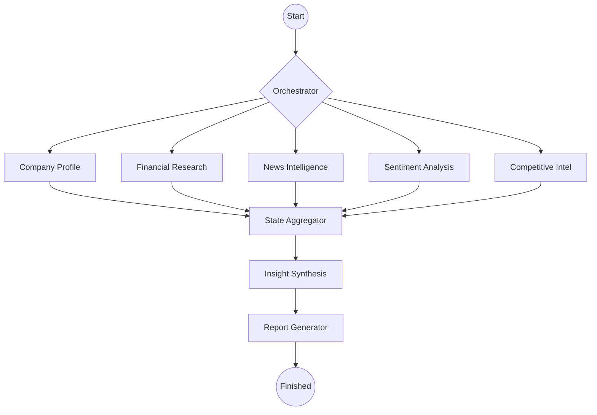
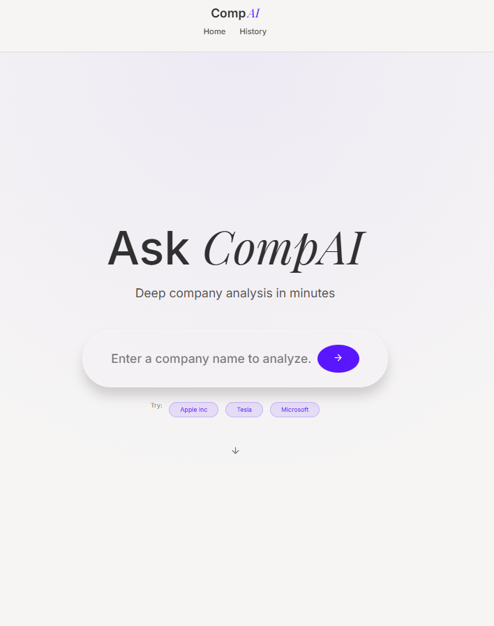
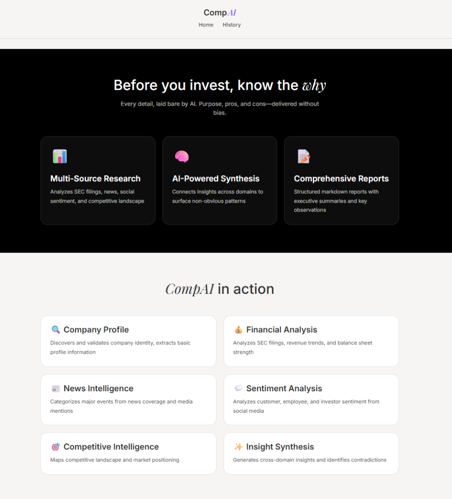
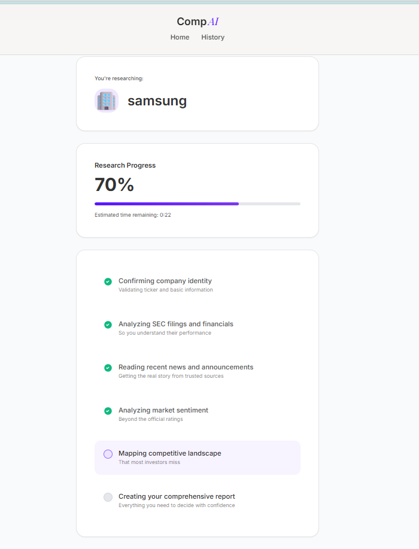
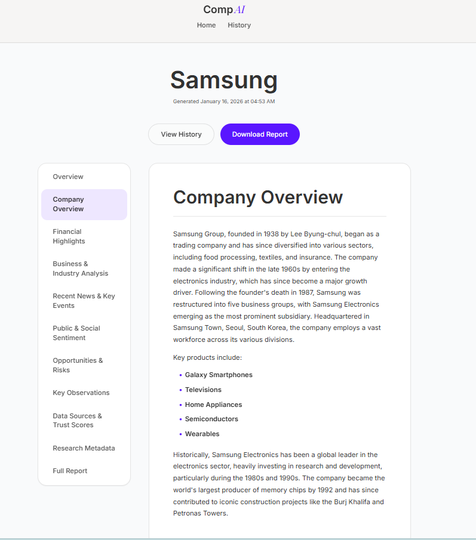

# CompAI - AI-Powered Company Research Platform 🚀

An advanced multi-agent research system with a modern web interface that autonomously gathers, validates, and synthesizes public data (Financials, News, Social, Competitive) into professional investment reports. Powered by **LangGraph** for resilient, reasoning-aware research workflows and **React + Vite** for a premium user experience.

---

## 🏗️ Architecture: Full-Stack AI Research Platform

### Backend: LangGraph-Based Agent System

The system utilizes a state-driven **LangGraph** orchestrator to manage specialized research nodes. This allows for parallel execution, structured reasoning, and graceful fallbacks across multiple LLM providers.



### Frontend: Modern React Application

- **Framework**: React 19 with TypeScript
- **Build Tool**: Vite for fast development and optimized builds
- **Routing**: React Router DOM for seamless navigation
- **Animations**: Framer Motion for smooth UI transitions
- **Styling**: Custom CSS with modern design patterns
- **API Communication**: Axios for backend integration

### 🧠 Specialized Research Agents
1. **Company Profile Agent**: Validates company identity and extracts **Wikipedia-based historical context**.
2. **Financial Research Agent**: Parses SEC filings with **automated anomaly detection** (flagging unusual growth/margins).
3. **News Intelligence Agent**: Uses **ScrapingBee** (Main) or **SerpAPI** (Fallback) to build chronological event timelines from real news.
4. **Sentiment Analysis Agent**: Implements **multi-stage fallback** (Social/Reddit/Reviews) when news data is sparse.
5. **Competitive Intelligence Agent**: Maps competitors, SWOT, and market positioning.
6. **Synthesis Engine**: Performs reasoning-aware data aggregation to resolve contradictions and surface "non-obvious" insights.

---

## ✨ Key Features

### 1. **Modern Web Interface** 🎨
- **Premium Design**: Sleek, professional UI with smooth animations and transitions
- **Real-time Progress**: Live updates on research progress with detailed agent status
- **Interactive Reports**: Sidebar navigation with downloadable PDF reports
- **Responsive Layout**: Works seamlessly across desktop and mobile devices
- **Dark Mode Support**: Eye-friendly interface for extended research sessions

### 2. **Robust Data Sourcing** 📰
- **ScrapingBee & SerpAPI Integration**: Multi-layered news and search sourcing with JS-rendering support
- **Wikipedia History Extraction**: Automatically parses founding, IPO, and M&A history
- **SEC EDGAR Parsing**: Direct extraction of income statements and balance sheets from official filings

### 3. **Financial Anomaly Detection** 📊
- Automated logic to flag data points requiring human review:
  - Unusual revenue/earnings growth (>100% YoY)
  - Significant negative margins
  - Conflicts between different financial data points

### 4. **Resilient LLM Fallback Chain** 🛡️
Supports automatic provider-switching to maintain 100% uptime using free-tier APIs:
- **OpenAI GPT 4o-mini** (Primary)
- **Groq** (Llama 3.3 70B - High speed)
- **Google Gemini 2.0 Flash** / **Cohere** / **Together AI** / **Hugging Face**

---

## 📦 Installation & Setup

### Prerequisites

Before setting up CompAI, ensure you have the following installed:

- **Python 3.9+** - For the backend research agents
- **Node.js 18+** and **npm** - For the frontend application
- **Git** - For cloning the repository

### 1. Clone the Repository

```bash
git clone https://github.com/your-repo/CompAI.git
cd CompAI
```

### 2. Backend Setup

#### Install Python Dependencies

```bash
# Create virtual environment
python -m venv .venv

# Activate virtual environment
# Windows:
.venv\Scripts\activate
# macOS/Linux:
source .venv/bin/activate

# Install dependencies
pip install -r backend/requirements.txt
```

#### Configure API Keys

Create a `.env` file in the `backend/` directory:

```bash
# LLM Providers (At least one required)
GOOGLE_API_KEY=your_google_api_key_here
GROQ_API_KEY=your_groq_api_key_here
COHERE_API_KEY=your_cohere_api_key_here

# Scraping / Data Sources
SCRAPINGBEE_API_KEY=your_scrapingbee_key_here  # Primary Scraper & Search
SERPAPI_API_KEY=your_serpapi_key_here          # Fallback for Rich News & Search
```

> [!IMPORTANT]
> You need at least **one LLM provider API key** and **one scraping API key** for the system to function properly.

#### Start the Backend Server

```bash
cd backend
python -m uvicorn app.main:app --reload --port 8000
```

The backend API will be available at `http://localhost:8000`

### 3. Frontend Setup

#### Install Node Dependencies

```bash
cd frontend
npm install
```

#### Configure Frontend Environment (Optional)

Create a `.env` file in the `frontend/` directory if you need to customize the API endpoint:

```bash
VITE_API_URL=http://localhost:8000
```

#### Start the Development Server

```bash
npm run dev
```

The frontend will be available at `http://localhost:5173`

### 4. Verify Installation

1. Open your browser and navigate to `http://localhost:5173`
2. Enter a company name (e.g., "Apple Inc", "Tesla", "Microsoft")
3. Watch the real-time progress as agents gather and analyze data
4. Review the comprehensive report generated

---

## 💻 Usage

### Web Interface (Recommended)

1. **Start both backend and frontend servers** (see setup instructions above)
2. **Navigate to** `http://localhost:5173` in your browser
3. **Enter a company name** in the search field
4. **Monitor progress** as the AI agents research the company
5. **Review the report** with interactive navigation
6. **Download PDF** for offline access

### CLI Interface (Advanced)

For programmatic access or automation:

```bash
cd backend
python run_cli.py --company "NVIDIA" --ticker NVDA
```

#### CLI Options:
- `--company`: Full name of the company (required)
- `--ticker`: Stock symbol for faster financial discovery (optional)
- `--no-parallel`: Run agents sequentially for debugging (optional)

---

## 🗂️ Project Structure

```text
CompAI/
├── backend/                    # Python backend with LangGraph agents
│   ├── app/
│   │   ├── agents/            # Research agent implementations
│   │   │   ├── company_profile_agent.py
│   │   │   ├── financial_research_agent.py
│   │   │   ├── news_intelligence_agent.py
│   │   │   ├── sentiment_analysis_agent.py
│   │   │   ├── competitive_intelligence_agent.py
│   │   │   └── orchestrator.py
│   │   ├── api/               # FastAPI routes
│   │   │   └── routes.py
│   │   ├── core/              # Core configuration and state
│   │   │   ├── config.py
│   │   │   ├── llm_manager.py
│   │   │   └── state.py
│   │   ├── synthesis/         # Insight synthesis engine
│   │   │   └── synthesizer.py
│   │   ├── reporting/         # Report generation
│   │   │   └── report_generator.py
│   │   ├── utils/             # Utilities (scrapers, parsers)
│   │   ├── schemas/           # Pydantic models
│   │   ├── services/          # Business logic services
│   │   └── main.py            # FastAPI application entry point
│   ├── reports/               # Generated research reports
│   ├── annual_reports/        # Downloaded SEC filings
│   ├── cache/                 # Agent response cache
│   ├── requirements.txt       # Python dependencies
│   ├── .env.example          # Example environment variables
│   └── run_cli.py            # CLI entry point
│
├── frontend/                  # React + TypeScript frontend
│   ├── src/
│   │   ├── components/       # Reusable UI components
│   │   ├── pages/            # Page components
│   │   │   ├── Home.tsx      # Landing page
│   │   │   ├── Research.tsx  # Research progress page
│   │   │   ├── Report.tsx    # Report display page
│   │   │   └── History.tsx   # Research history
│   │   ├── styles/           # CSS stylesheets
│   │   ├── types/            # TypeScript type definitions
│   │   ├── utils/            # Frontend utilities
│   │   ├── App.tsx           # Main application component
│   │   └── main.tsx          # Application entry point
│   ├── public/               # Static assets
│   ├── package.json          # Node dependencies
│   ├── tsconfig.json         # TypeScript configuration
│   ├── vite.config.ts        # Vite configuration
│   └── .env.example          # Example frontend environment
│
└── README.md                 # This file
```

---

## 📝 Example Report Output

The agent produces comprehensive, structured reports containing:

- **Executive Summary** - High-level overview with key insights
- **Company Overview** - Historical context from Wikipedia and validated company information
- **Financial Highlights** - Key metrics with anomaly warnings and trend analysis
- **Business & Industry Analysis** - Market positioning and competitive dynamics
- **Recent News & Key Events** - Categorized timeline of significant developments
- **Public & Social Sentiment** - Trust-weighted sentiment analysis from multiple sources
- **Opportunities & Risks** - AI-synthesized insights on potential upsides and concerns
- **Key Observations** - Non-obvious patterns and contradictions surfaced by the synthesis engine
- **Data Sources & Trust Scores** - Complete transparency on data provenance and reliability
- **Research Metadata** - Provider usage, reasoning steps, and execution details

---

## 🚀 Production Deployment

### Backend Deployment

```bash
# Build production environment
pip install -r backend/requirements.txt

# Run with production ASGI server
uvicorn app.main:app --host 0.0.0.0 --port 8000 --workers 4
```

### Frontend Deployment

```bash
# Build optimized production bundle
cd frontend
npm run build

# The dist/ folder contains the production-ready static files
# Deploy to any static hosting service (Vercel, Netlify, AWS S3, etc.)
```

---

## 🛠️ Technology Stack

### Backend
- **Python 3.9+** - Core language
- **FastAPI** - Modern web framework
- **LangGraph** - Agent orchestration
- **Pydantic** - Data validation
- **Uvicorn** - ASGI server
- **ScrapingBee / SerpAPI** - Web scraping
- **Multiple LLM Providers** - OpenAI, Gemini, Groq, Cohere, Huggingface

### Frontend
- **React 19** - UI framework
- **TypeScript** - Type safety
- **Vite** - Build tool and dev server
- **React Router DOM** - Client-side routing
- **Framer Motion** - Animations
- **Axios** - HTTP client

---

## 🛡️ License & Principles

- **Synthesis Over Collection**: Focus on "Why" and "So What?", not just "What"
- **Source Transparency**: Every data point includes a trust score (0-1.0) and source link
- **Privacy First**: Research is performed on public endpoints only
- **User-Centric Design**: Premium, intuitive interface for professional researchers

---

## 🤝 Contributing

Contributions are welcome! Please feel free to submit a Pull Request.

---

**Built with**: LangGraph, FastAPI, React, Vite, ScrapingBee, SerpAPI, and Multiple LLM Providers

## 📸 Screenshots

### Home Page


* Clean, modern interface for entering company names to begin research*

### Features-Overview


* Overview of the features of the application*

### Research Progress


* Real-time progress tracking with detailed agent status and estimated time remaining*

### Report View


* Interactive report with sidebar navigation and comprehensive company analysis*
