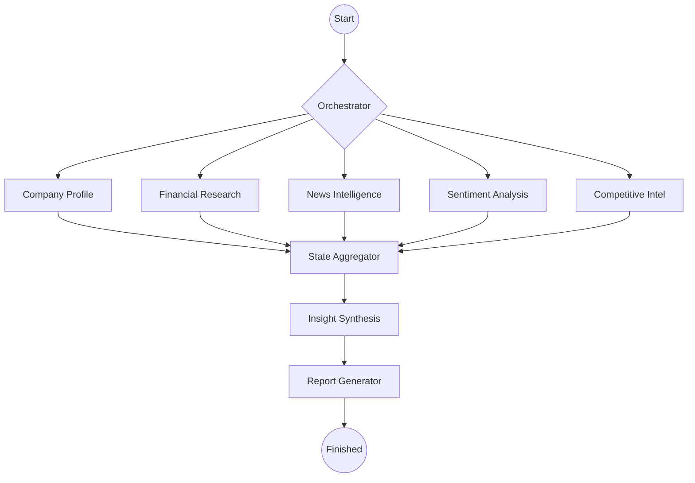

# Deep Research Agent - AI Investment Analyst 🚀

An advanced multi-agent research system that autonomously gathers, validates, and synthesizes public data (Financials, News, Social, Competitive) into professional investment reports. Powered by **LangGraph** for resilient, reasoning-aware research workflows.

---

## 🏗️ Architecture: LangGraph-Based

The system utilizes a state-driven **LangGraph** orchestrator to manage specialized research nodes. This allows for parallel execution, structured reasoning, and graceful fallbacks across multiple LLM providers.



### 🧠 Specialized Research Agents
1. **Company Profile Agent**: Validates company identity and extracts **Wikipedia-based historical context**.
2. **Financial Research Agent**: Parses SEC filings with **automated anomaly detection** (flagging unusual growth/margins).
3. **News Intelligence Agent**: Uses **ScrapingBee** (Main) or **SerpAPI** (Fallback) to build chronological event timelines from realnews.
4. **Sentiment Analysis Agent**: Implements **multi-stage fallback** (Social/Reddit/Reviews) when news data is sparse.
5. **Competitive Intelligence Agent**: Maps competitors, SWOT, and market positioning.
6. **Synthesis Engine**: Performs reasoning-aware data aggregation to resolve contradictions and surface "non-obvious" insights.

---

## ✨ Key Features

### 1. **Robust Data Sourcing** 📰
- **ScrapingBee & SerpAPI Integration**: Multi-layered news and search sourcing with JS-rendering support for robust data collection.
- **Wikipedia History Extraction**: Automatically parses founding, IPO, and M&A history for richer context.
- **SEC EDGAR Parsing**: Direct extraction of income statements and balance sheets from official filings.

### 2. **Financial Anomaly Detection** 📊
- Automated logic to flag data points requiring human review:
  - Unusual revenue/earnings growth (>100% YoY).
  - Significant negative margins.
  - Conflicts between different financial data points.

### 3. **Resilient LLM Fallback Chain** 🛡️
Supports automatic provider-switching to maintain 100% uptime using free-tier APIs:
- **Google Gemini 2.0 Flash** (Primary)
- **Groq** (Llama 3.3 70B - High speed)
- **Cohere** / **Together AI** / **Hugging Face**

---

## 📦 Installation & Setup

### 1. Environment Setup
```bash
# Clone the repository
git clone https://github.com/your-repo/CompAI.git
cd CompAI

# Create virtual environment
python -m venv .venv
source .venv/bin/activate  # Windows: .venv\Scripts\activate

# Install dependencies
pip install -r backend/requirements.txt
```

### 2. Configure Keys
Create a `.env` in the `backend/` directory:
```bash
# LLM Providers (At least one required)
GOOGLE_API_KEY=...
GROQ_API_KEY=...
COHERE_API_KEY=...

# Scraping / Data
SCRAPINGBEE_API_KEY=...  # Primary Scraper & Search
SERPAPI_API_KEY=...      # Fallback for Rich News & Search
```

---

## 💻 Usage

Run the research pipeline via the CLI entry point:

```bash
cd backend
python run_cli.py --company "NVIDIA" --ticker NVDA
```

### Options:
- `--company`: Full name of the company.
- `--ticker`: (Optional) Stock symbol for faster financial discovery.
- `--no-parallel`: Run agents sequentially (useful for debugging or rate-limit management).

---

## 🗂️ Project Structure (Refactored)

```text
backend/
├── app/
│   ├── agents/          # LangGraph Nodes (Profile, Financial, News, etc.)
│   ├── core/            # State Schema, Configuration, Orchestrator logic
│   ├── synthesis/       # Insight Synthesizer
│   ├── reporting/       # Markdown Report & Chart Generation
│   ├── utils/           # Scrapers (SerpAPI), PDF Parsers, Logger
│   └── main.py          # API Entry Point
├── reports/             # Generated Research Reports (.md)
├── annual_reports/      # Downloaded SEC filings (.pdf)
└── run_cli.py           # CLI Command Line Tool
```

---

## 📝 Example Report Output
The agent produces high-density Markdown reports containing:
- **Executive Summary** (3-4 sentences).
- **Historical Context** extracted from Wikipedia.
- **Financial Highlights** with **Anomaly Warnings**.
- **Categorized News Timeline** (Past 6 months).
- **Trust-Weighted Sentiment Distribution**.
- **Research Metadata** (Trust scores, reasoning steps, provider usage).

---

## 🛡️ License & Principles
- **Synthesis Over Collection**: Focus on "Why" and "So What?", not just "What".
- **Source Transparency**: Every data point includes a trust score (0-1.0) and source link.
- **Privacy First**: Research is performed on public endpoints only.

---

**Built with**: LangGraph, ScrapingBee, SerpAPI, LLM Fallbacks (Groq/Cohere/Gemini).
